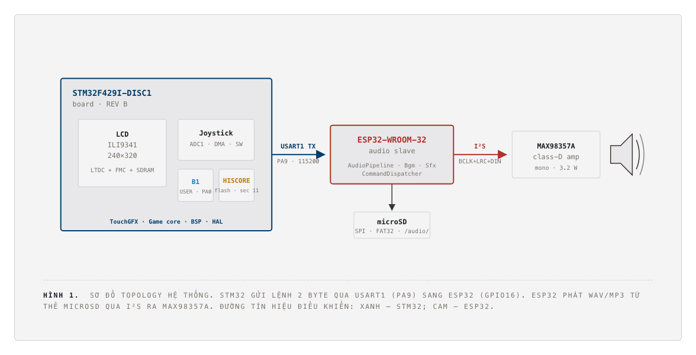
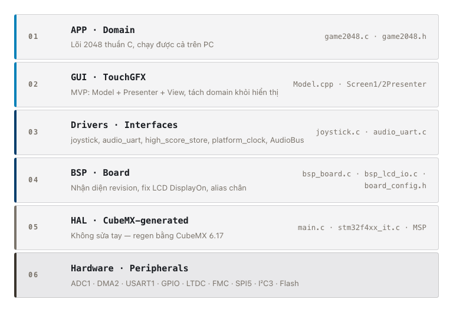
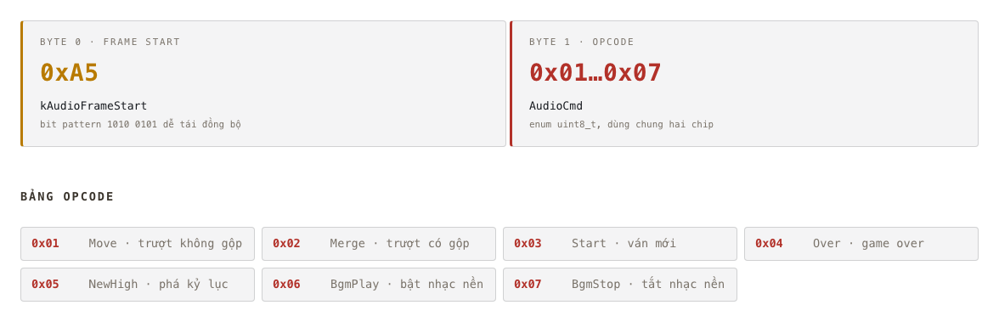

# game2048

Đồ án Hệ Nhúng (IT4210, HUST) - game 2048 chạy trên **STM32F429I-DISC1**, giao diện dựng bằng **TouchGFX**, âm thanh phát qua một **ESP32-WROOM-32** đóng vai audio slave.

STM32 giữ mọi thứ hiển thị và nhập liệu (LCD, joystick, điểm cao); ESP32 chỉ phụ trách phát nhạc nền/hiệu ứng từ thẻ microSD. Hai chip nói chuyện một chiều qua UART với khung lệnh 2 byte.

<p align="center">
  
</p>

## Phần cứng

| | STM32F429I-DISC1 | ESP32-WROOM-32 |
|---|---|---|
| Vai trò | Master · UI · Logic | Slave · chỉ âm thanh |
| Lõi | Cortex-M4F · 180 MHz | Dual Xtensa LX6 · 240 MHz |
| Bộ nhớ | 2 MB flash · 256 KB SRAM · 8 MB SDRAM | 520 KB SRAM · 4 MB flash |
| Framework | TouchGFX 4.19 · FreeRTOS (CMSIS-RTOS2) | Arduino · PlatformIO |
| Đầu vào | Joystick analog (ADC1 + DMA) · nút B1 | Serial2 (UART) từ STM32 |
| Đầu ra | LCD ILI9341 240×320 qua LTDC + FMC + SDRAM | I²S → MAX98357A (class-D amp, mono, 3.2 W) |
| Lưu trữ | Điểm cao ở flash sector 11 | File nhạc/hiệu ứng trên microSD (FAT32, SPI 4 MHz) |

Kết nối điều khiển: `STM32 USART1 TX (PA9)` → `ESP32 Serial2 RX (GPIO16)`, 115200 8N1, một chiều.

## Kiến trúc phần mềm STM32

Firmware chia 6 tầng, tầng trên không include HAL trực tiếp - lõi game (`game2048.c`) là C thuần, biên dịch và test được cả ngoài board.

<p align="center">
  
</p>

- **Game core** (`Core/Src/game2048.c`): lưới 4×4, luật gộp ô 2048 kinh điển, không phụ thuộc phần cứng.
- **GUI** (`TouchGFX/gui/`): mô hình MVP - `Model` giữ state game, `Screen1Presenter`/`Screen2Presenter` + View lo hiển thị (Screen1 = menu, Screen2 = bàn chơi).
- **Drivers/Interfaces**: `joystick.c` (đọc ADC 2 trục, edge-trigger + deadzone chống trôi), `audio_uart.c` (gửi lệnh sang ESP32), `flash_high_score_store.cpp` (lưu điểm cao vào flash).
- **BSP**: nhận diện revision board, cấu hình LCD/IOE/SPI5/I²C3.
- **HAL**: sinh bởi STM32CubeMX, không sửa tay.

## Giao thức âm thanh (UART)

Một khung chỉ gồm 2 byte: `[0xA5][opcode]`. `audio_protocol.h` là nguồn khai báo duy nhất, cả hai firmware cùng include.

<p align="center">
  
</p>

Phía ESP32 (`esp32_audio/src/`) chia 4 module: `AudioPipeline` (I²S + mixer), `BgmController` (nhạc nền, loop `bgm.mp3`), `SfxController` (hiệu ứng one-shot + ducking gain khi chồng tiếng), `CommandDispatcher` (máy trạng thái nhận khung UART, bảng lookup opcode → file WAV).

## Điểm cao

Lưu ở flash sector 11 (128 KB cuối bank 1, không đụng vùng firmware) dưới dạng bản ghi `MAGIC + SCORE + CHECKSUM`. Chỉ ghi khi có điểm mới cao hơn; reset bằng nút User B1 (PA0) trên màn menu.

## Cấu trúc thư mục dự án

```
projects/game2048/
├── Core/                # Firmware STM32: game core, drivers, BSP, HAL (CubeMX)
├── TouchGFX/             # GUI: gui/model, gui/screen1_screen, gui/screen2_screen, assets
├── STM32CubeIDE/         # Project STM32CubeIDE (build, linker script, debug)
├── esp32_audio/           # Firmware ESP32 (PlatformIO): AudioPipeline, Bgm/SfxController, CommandDispatcher
│   └── audio/             # File .wav/.mp3 chép ra thẻ microSD
└── *.ioc                  # Cấu hình CubeMX
```

## Build & nạp

**STM32** - mở `projects/game2048/STM32CubeIDE` bằng STM32CubeIDE, build rồi nạp qua ST-Link tích hợp trên board.

**ESP32** - mở `projects/game2048/esp32_audio`, build và nạp qua USB-UART; chép thư mục `audio/` vào thẻ microSD trước khi cắm vào module đọc thẻ.

